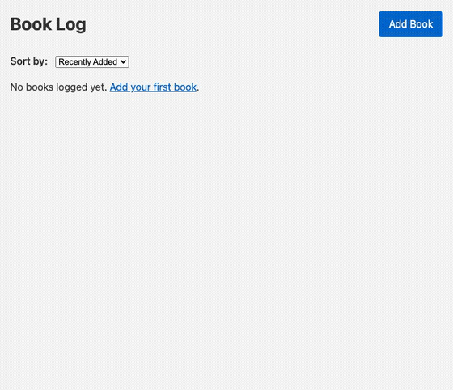
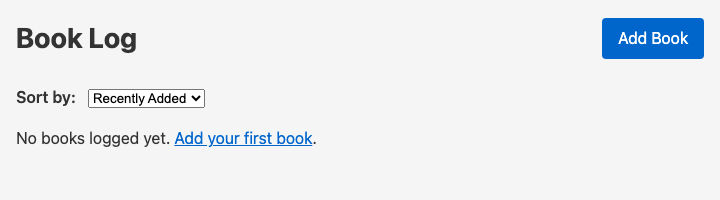
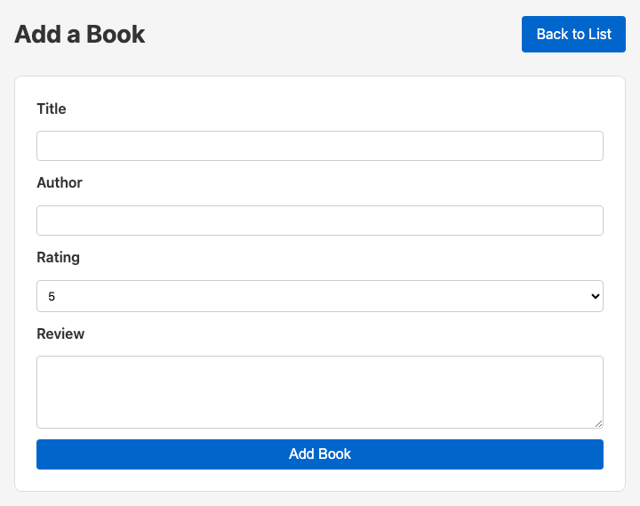
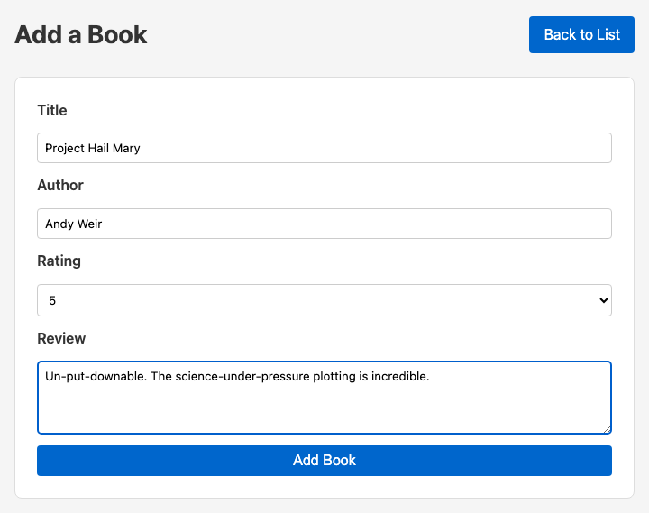
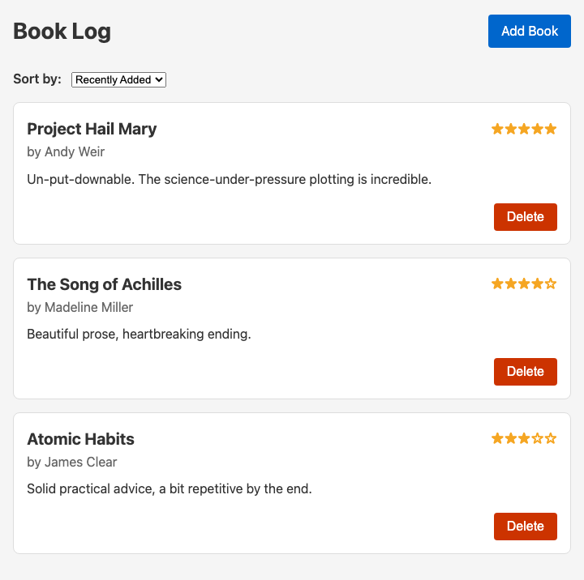
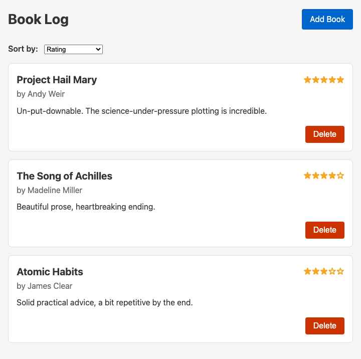

# Book Log

Book Log is a lightweight web application for tracking books you have read.
It stores each entry with a title, author, rating, short review, and created timestamp using SQLite.

## Demo



| State | Screenshot |
| --- | --- |
| Empty list |  |
| Add a book |  |
| Add form filled in |  |
| Populated list |  |
| Sorted by rating |  |

## Tech Stack

- Node.js
- Express
- EJS
- SQLite via better-sqlite3

## Current Features

- Add book entries with:
  - Title (required)
  - Author (required)
  - Rating (required, 1 to 5)
  - Review (optional)
- View all logged books on the main page
- Delete a book entry
- Sort book listings (title, rating, and most recently added)
- Persist data locally in books.sqlite

## Data Model

The app currently uses a books table with these fields:

- id (auto-increment primary key)
- title (text, required)
- author (text, required)
- rating (integer, required, constrained to 1-5)
- review (text, optional)
- created_at (timestamp, defaults to current time)

## Setup

### Prerequisites

- Node.js 18+ (Node.js 20+ recommended)
- npm

### Install Dependencies

If dependencies are not already installed:

1. Open a terminal in the project root.
2. Run:

```bash
npm install
```

### Playwright MCP and E2E Setup

This project now includes Playwright test configuration and a local MCP server definition.

1. Install browser binaries:

```bash
npm run test:e2e:install-browsers
```

2. Run end-to-end tests:

```bash
npm run test:e2e
```

Optional modes:

```bash
npm run test:e2e:headed
npm run test:e2e:slow
npm run test:e2e:ui
```

To customize slow-motion delay (milliseconds):

```bash
PW_SLOW_MO=800 npm run test:e2e:headed
```

MCP server config is in `.vscode/mcp.json` and uses `@playwright/mcp`.

## Run the Application

Start the app from the project root:

```bash
npm start
```

If your local setup does not have a start script yet, run:

```bash
node app.js
```

Then open:

- http://localhost:3000

## Basic Usage

1. Open the home page.
2. Add a new book entry.
3. View the list of books.
4. Change sort order.
5. Delete an entry if needed.

## Notes

- Database file: books.sqlite
- Data is stored locally on your machine.
